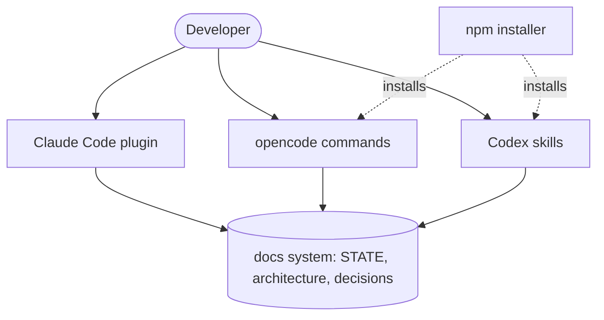

# STATE — <!-- updated: 2026-08-25 -->

## Current focus
0.1.4 in progress. The plugin is built, secured, ported to opencode and Codex, published
to npm, and installable from the marketplace. Decision-capture was reframed after a full
review: an honest list-based commit reminder plus an opt-in pre-commit hook (ADR-0014).

## Shape

## Done
- Claude Code plugin: six skills, two read-only agents, session-start hook, marketplace
  manifest. Passes `validate --strict`.
- opencode and Codex ports, each with secret-blind + anti-injection guardrails.
- Security hardening: secret-blind agents, commit secret gate, gitleaks CI, SECURITY.md.
- npm/npx distribution (zero-dependency installer); published `@chaitanya299/orient`, live
  through 0.1.2.
- Version-sync gate (ADR-0011): plugin.json is source of truth, package.json mirrors it,
  enforced on publish + CI.
- `decide` is proactive and keeps architecture.md + a STATE Shape diagram in sync.
- Published to github.com/Chaitanya299/Orient; installed from the marketplace, dogfooding.
- Decisions recorded: ADR-0001 through ADR-0014.

## In progress
- 0.1.4: list-based commit reminder + opt-in pre-commit hook; cut the `decide`-sweep idea.
  Code done and tested; publish pending.

## Next up
- Publish 0.1.4 to npm and `claude plugin update` to pull it.
- Tag `v0.1.0` (or current) on GitHub.
- Submit to the official directories (Claude Code: clau.de/plugin-directory-submission;
  Codex: package skills + OpenAI portal — see local PUBLISHING.md).

## Blocked / needs research
- Does decision-capture fire reliably? A full review (ADR-0014) cut the `decide`-sweep idea
  (a step inside `decide` can't catch a forgotten decision, and ADR-to-change pairing isn't
  computable from git) and reframed to a plain commit reminder + an opt-in hook. The real
  miss rate is still unmeasured — needs a week of use to confirm.
- Does `scripts/orient.sh` work under Git Bash and WSL on Windows? Untested.

## Known issues
- Shape diagram lives in a volatile file (`sync` rewrites STATE.md); mitigated by the 6-node
  cap and `decide` maintaining it, but drift is possible if a structural change skips `decide`.
